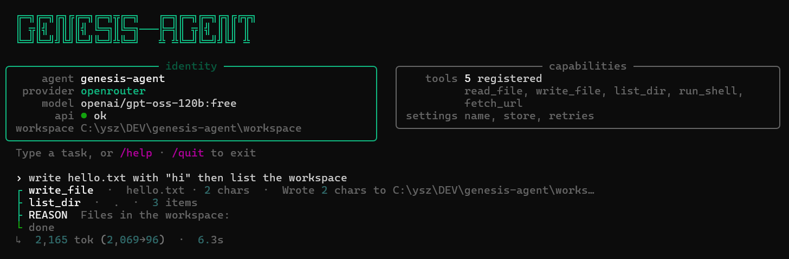
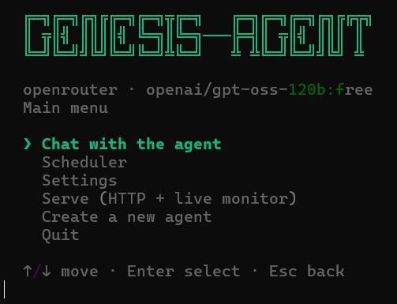

<div align="center">


**A lightweight, modular vertical-agent template built on [Pydantic AI](https://ai.pydantic.dev).**

*Copy the folder · edit one file · drop in tools → a specialized agent is ready.*


</div>

---

You want your own AI agent — a trading assistant, a research bot, a support
automation. Building it from scratch means weeks of plumbing before any real
work: model APIs, tool calling, retries, state, a console, deployment.

**genesis-agent removes that part.** It's a strong, finished foundation for
agents of any complexity: copy the folder, describe your agent's role in
`persona.md`, drop your domain tools into `tools/` — done. Everything generic
is already built and stays frozen: provider wiring (OpenAI · Anthropic ·
OpenRouter · offline Ollama), automatic tool discovery, the agent loop,
cross-run memory, a live console. You write only what makes your agent *yours*.

And unlike heavyweight frameworks, there's no magic to fight: the whole engine
is ~2k lines of readable Python on Pydantic AI — small enough to read in an
evening, simple enough to trust in production.

It runs in any environment from day one — interactive terminal, headless HTTP
service, Docker container, or on a schedule via cron / Task Scheduler. A fresh
copy is already a working general-purpose agent with five built-in tools:



## Quickstart

Open a terminal in an **empty folder** and paste — this downloads the project,
installs `uv` and all dependencies, and creates `.env`:

```powershell
# Windows (PowerShell)
irm https://raw.githubusercontent.com/ysz7/genesis-agent/main/scripts/install.ps1 | iex
```

```bash
# Linux / macOS
curl -LsSf https://raw.githubusercontent.com/ysz7/genesis-agent/main/scripts/install.sh | sh
```

Then set `PROVIDER` / `MODEL` / `API_KEY` in `.env` and launch: **`start.cmd`**
(Windows) / **`./start.sh`** (Linux/macOS).

Manual install (clone first):

```bash
git clone https://github.com/ysz7/genesis-agent.git
cd genesis-agent
powershell -ExecutionPolicy Bypass -File scripts\install.ps1   # Windows
./scripts/install.sh                                           # Linux/macOS
```

- No API key? Set `PROVIDER=ollama`, `MODEL=llama3.1:8b`,
  `BASE_URL=http://localhost:11434/v1` — fully offline.
- Forked the repo? Point the installer at it: edit `$Repo` / `REPO` in
  `scripts/install.*` or set `GENESIS_REPO=...`.

## Features

- **Stands on Pydantic AI** — provider-agnostic models, native tool calling,
  retries, schema-from-type-hints. No hand-rolled transport or JSON schema.
- **Drop-in tools** — any documented, type-hinted function in `tools/*.py` is
  auto-discovered and registered. No wiring.
- **4 providers, switched via `.env`** — OpenAI · Anthropic · OpenRouter ·
  Ollama (offline, no key).
- **Live console** — reasoning tree (reason → tool → result) with a
  `tokens · cost · elapsed` footer.
- **State store** — `get/set/append/all` over JSON or SQLite for cross-run
  memory; **structured output** — return a typed Pydantic model instead of prose.
- **Headless HTTP mode** (`--serve`, zero extra deps), **optional
  [MCP](https://modelcontextprotocol.io) servers** from config, **Docker-ready**.
- **Scales by copy** — one folder + one process per agent. 50 agents = 50 folders.

## Usage

**`start.cmd`** / **`./start.sh`** opens an arrow-key start menu: Chat ·
Scheduler · Settings · Serve · Quit. The launchers find `uv` and auto-install
deps on first run.



Pass a task or flags to skip the menu:

```bash
start.cmd "Summarize the README in three bullets"   # one-shot
start.cmd --serve                                    # HTTP service
```

From a terminal, run `uv` **inside the agent folder** — `.env` / `persona.md` /
`settings.yaml` are loaded from the current directory (use `--root path/to/agent`
from elsewhere):

```bash
uv run agent "Summarize the README in three bullets"   # one-shot
uv run agent                                            # interactive REPL
uv run agent --serve --port 8181                        # HTTP service
```

```bash
curl -X POST localhost:8181/task -H "content-type: application/json" \
     -d '{"task": "what files are in the workspace?"}'
```

## Make a vertical agent

Run the wizard: **`scripts/new-agent.cmd`** / **`./scripts/new-agent.sh`** (or
*Create a new agent* in the menu). Enter name, role, provider, model, key — it
scaffolds a ready-to-run agent in a sibling folder `../<name>` with a generated
`persona.md` / `settings.yaml` / `.env` and a copy of the engine.

Then refine it:

1. Edit **`persona.md`** — the system prompt.
2. Drop domain tools into **`tools/`** — one documented, type-hinted function
   per tool; take `ctx: RunContext[AgentDeps]` as the first parameter to reach
   the http client / store / settings.
3. Run **`start.cmd`** / `./start.sh`.

A fully filled-in vertical lives in
[`examples/rss_research/`](examples/rss_research/) — drop-in tool,
settings-driven feeds, store-based dedup, structured output.

## Providers

| `PROVIDER`   | `MODEL` example                | API key | Notes |
|--------------|--------------------------------|---------|-------|
| `openai`     | `gpt-4o-mini`                  | ✓       | |
| `anthropic`  | `claude-haiku-4-5`             | ✓       | |
| `openrouter` | `openai/gpt-oss-120b:free`     | ✓       | `BASE_URL` auto-set |
| `ollama`     | `llama3.1:8b`                  | ✗       | offline, no key needed |

Switching is a `.env` edit — no code changes.

## MCP servers (optional)

```bash
uv sync --extra mcp
```

```yaml
# settings.yaml
mcp:
  - name: demo
    command: python
    args: ["examples/mcp_demo/echo_server.py"]   # local stdio server
  - name: docs
    url: https://example.com/mcp                  # remote server
```

Their tools appear to the agent like built-ins (prefixed with `name`). Demo:
[`examples/mcp_demo/`](examples/mcp_demo/). Without an `mcp:` block nothing changes.

## Docker

```bash
cp .env.example .env
docker compose up --build      # serves POST /task on :8181
```

`workspace/` is mounted as a volume, so state persists. One-shot:
`docker run --rm --env-file .env genesis-agent uv run agent "your task"`.

## Scheduling

**In-app** — the *Scheduler* menu item runs recurring tasks in a live feed.
Jobs persist in the state store but fire only while the scheduler is open.

**External (24/7)** — drive one-shot runs with cron / systemd / Task Scheduler
via `scripts/run.sh` / `scripts/run.ps1` (not `start.cmd` — it ends with
`pause`). Templates: [`schedule.example`](schedule.example).

```bash
# cron — every hour
0 * * * * /path/to/agent/scripts/run.sh "Run the hourly briefing" >> /path/to/agent/workspace/cron.log 2>&1
```

```powershell
# Windows Task Scheduler — daily at 9am
$root    = "C:\path\to\agent"
$action  = New-ScheduledTaskAction -Execute "powershell.exe" `
    -Argument "-NoProfile -ExecutionPolicy Bypass -File `"$root\scripts\run.ps1`" `"Run the hourly briefing`""
$trigger = New-ScheduledTaskTrigger -Daily -At 9am
Register-ScheduledTask -TaskName "genesis-agent" -Action $action -Trigger $trigger
```

## Project structure

```
genesis-agent/
├── agent/                  the frozen engine (never edited per vertical)
│   ├── __main__.py         entrypoint: menu · one-shot · REPL · --serve
│   ├── __init__.py         public API: `from agent import AgentDeps, parse_rss`
│   ├── runtime/            config · context (AgentDeps) · store (JSON|SQLite)
│   ├── engine/             model · registry · factory · mcp (builds the Agent)
│   ├── tools/              builtins (5 tools) · toolkit (http/cache/rss helpers)
│   ├── console/            display (rich tree · spinner · stats) · menu
│   └── server/             stdlib HTTP POST /task + live monitor
├── persona.md              the vertical's system prompt          ← yours
├── settings.yaml           non-secret config (feeds, mcp, …)     ← yours
├── .env                    secrets (provider, model, key)        ← yours
├── tools/                  drop-in custom tools (auto-discovered) ← yours
├── examples/               filled-in verticals to copy from
├── scripts/                install · run · fleet · new-agent helpers
├── start.cmd / start.sh    double-click launchers (start menu)
└── Dockerfile · docker-compose.yml
```

## License

MIT — see [LICENSE](LICENSE).
